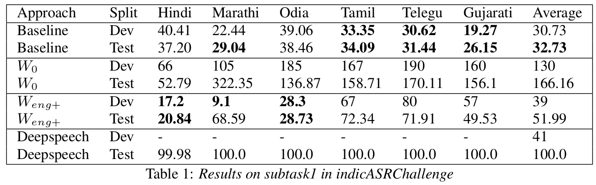
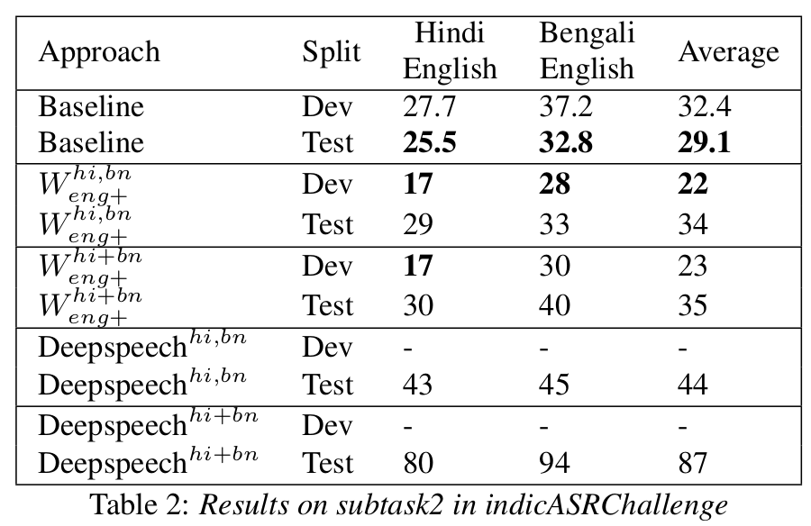

# Multilingual-Indic-ASR

The competition was hosted [here](https://navana-tech.github.io/IS21SS-indicASRchallenge/). Organizers provided us with a large number of annotated data. You can see that on their website. I hope it is still downloadable. But even if it is not, we have mentioned the paths to it below.

There was some additional data which we used.

1. Umesh1: this data was provided to us by IITM speech labs headed by professor Umesh. This contains a total of 130 hours of Hindi audio, out of which 50 hours of audio is transcribed.
2. LDC: this data was obtained from [ILDC](https://data.ldcil.org/speech/speech-raw-corpus/hindi-raw-speech-corpus). This is a raw corpus. There is approx 118 hours of audio with noisy/faulty transcriptions. For eg: the transcription was "बुधवार", the speaker repeats it 3 times in the audio.<br>Moreover the transcriptions were not aligned i.e. 5 minute of audio had 200-500 word transcription. This was not suitable to train or test an E2E model. Hence, we used [aeneas](https://github.com/readbeyond/aeneas) for forced alignment.
<br>We also wrote a small code which converts all the numbers to its word form. It handles ordinals and cardinals both. For eg: it will "रामप्रसाद के 2 बेटे" → "रामप्रसाद के दो बेटे", and "रामप्रसाद कि 13वी" → "रामप्रसाद कि तेरवी".
<br>But sometimes transcriptions were incorrect in the first place. So this data is technically not a gold standard.

## Models

### Wav2vec

We used [this](https://github.com/mailong25/self-supervised-speech-recognition) library.

#### Pre-training

Our audios for pre-training are stored in one folder named ```audios3```.

**Data Stats**

Language | Mean (secs) | Max (secs) | Min (secs)* | Total Files* | Total Hours
--- | --- | --- | --- |--- | --- |
Hindi+Odia+Marathi+Tamil+Telegu+Gujarati+Hinglish+Benglish | 5.79 | 60.0 | 0.1 | 496709 | 811

```
* this is after ignoring the 7454 files with duration equal to 0.0
```

#### Finetuning

**Subtask 1) Multilingual ASR**

*Train Stats*

Language | Mean | Max | Min | Total Files | Total Hours*
--- | --- | --- | --- |--- | --- |
Hindi | 3.42 | 15.9 | 1.02 | 99925 | 95.0
Odia | 5.69 | 48.11 | 1.51 | 59782 | 94.5
Marathi | 4.26 | 52.52 | 1.0 | 79432 | 93.8
Gujarati | 6.31 | 23.22 | 1.01 | 22807 | 39.4
Tamil | 3.68 | 18.57 | 0.325 | 39131 | 39.9
Telegu | 3.21 | 23.61 | 0.325 | 44882 | 40.0
| | | | | 402.6

*Valid Stats*

Language | Mean | Max | Min | Total Files | Total Hours*
--- | --- | --- | --- |--- | --- |
Hindi | 5.20 | 12.66 | 1.92 | 3843 | 5.5
Odia | 5.7 | 18.41 | 1.56 | 3471  | 5.4
Marathi | 3.85 | 11.48 | 1.0 | 4675 | 5.0
Gujarati | 5.85 | 13.89 | 1.97 | 3075 | 4.9
Tamil | 5.85 | 14.5 | 1.71 | 3081  | 4.9
Telegu | 5.92 | 19.66 | 1.514 | 3040 | 4.9
| | | | | 30.6

```
* this is as per the actual segmented data we have
```

**Subtask 2) Code-switched ASR**

*Train Stats*

Language | Mean | Max | Min | Total Files | Total Hours
--- | --- | --- | --- |--- | --- |
Hindi | 2.97 | 57.0 | 0.2 | 414698 | 341*
Bengali | 6.21 | 57.0 | 1.0 | 26606 | 45

```
* this includes training data of Umesh1 (40 hr) + testing data of Umesh1 (5hr) + LDC training data (106 hr) + subtask 2 Hindi training data (89 hr) + subtask 1 Hindi training data (95 hr) + subtask 1 Hindi validation data (5.5 hr)
```

*Valid Stats*

Language | Mean | Max | Min | Total Files | Total Hours
--- | --- | --- | --- |--- | --- |
Hindi | 2.39 | 41.0 | 0.2 | 33907 | 22*
Bengali | 5.90 | 29.0 | 1.0 | 4275 | 7

```
* this includes validation data of Umesh1 (5 hr) + validation data of LDC (12 hr) + subtask 2 Hindi validation data (5.1 hr)
```

### DeepSpeech

We used the library by Sean Naren. We used the warp-CTC loss because pytorch-CTC was not working.

There is no pre-training and finetuning concept here. So we simply trained. SpecAug and TemporalGain were set to true. No noise augumentation was used.

**Subtask 1) Multilingual ASR**

Data stats are identical to wav2vec above.

**Subtask 2) Code-switched ASR**

In this task, I observed NaN loss with the training data described in wav2vec. Hence I used pure data for this task. With pure data I meant, the data released by organizers for this task.


## Our results


For our experiments related to wav2vec, we pretrained two kind of models: (a) We pretrained wav2vec base model, from scratch (```W_0```) on the audio dump. (b) On top of an already pretrained English base model, we pretrained our wav2vec base model (```W_{eng+}```) on the audio dump.


Link to [paper](https://drive.google.com/file/d/1vdsQO2iDnHKm7oiO6uD7buPaNSobJMRC/view?usp=sharing)
## Paths

*We confused subtask1 as subtask2, and vice versa. So you might see that manifests of subtask1 are inside subtask2 folder. Just trust us on this, it is right.*

Folder containing all the audios for wav2vec pretraining: ```/media/nas_mount/Ritwik/audios3/```

Subtask1 deepspeech manifest folder: ```/media/nas_mount/Ritwik/subtask2_finetuning/deepspeech_manifest/```

Subtask2 deepspeech manifest folder: ```/media/nas_mount/Ritwik/subtask1_finetuning/deepspeech_manifest/```

Entire data is neatly stored here: ```/media/nas_mount/Ritwik/speech_dataset```
